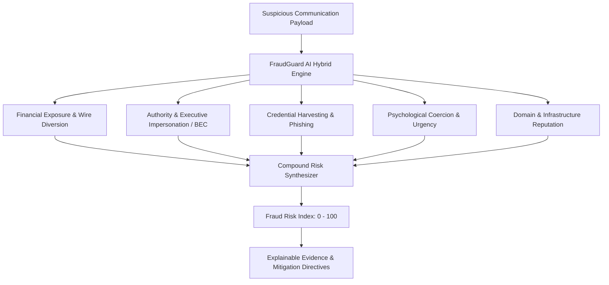

<div align="center">

# 🛡️ FraudGuard AI
### Enterprise Fraud, BEC & Phishing Intelligence Platform

[](#)
[](#)
[](#)
[](#)
[](#)

**FraudGuard AI** is a state-of-the-art cybersecurity platform engineered to detect and intercept **Business Email Compromise (BEC)**, **wire transfer diversion**, **credential harvesting**, and **cryptocurrency investment schemes** before capital loss occurs.

[🚀 Quickstart](#-quickstart) • [✨ Key Capabilities](#-key-capabilities) • [🔬 Multi-Vector Detection](#-multi-vector-threat-matrix) • [🐍 Python Engine](#-standalone-python-engine) • [📊 MITRE ATT&CK Mapping](#-mitre-attck-taxonomy)

</div>

---

## 🌟 Overview

Traditional spam filters only look for generic marketing spam and junk keywords. Modern financial fraud relies on targeted social engineering, secrecy mandates, spoofed sender domains, and urgent wire redirection that bypass standard spam defenses.

**FraudGuard AI** bridges this gap through a hybrid architecture combining:
1. **Local Neural Embeddings** (TensorFlow.js offline in the browser).
2. **Deep Semantic & Heuristic Vector Engine** (extracting financial stakes, SWIFT/ACH routing, cryptocurrency wallet addresses, and coercive isolation syntax).
3. **Explainable AI (XAI)** providing interactive highlighted text evidence, direct root cause justifications, and actionable operational directives.

---

## ✨ Key Capabilities

| Feature | Description |
|---|---|
| **🎯 Instant Operational Verdicts** | Delivers clear primary and secondary directives (e.g., `HALT TRANSACTION: Do not initiate SWIFT/ACH wire transfer`). |
| **🔍 Explainable AI Evidence** | Interactive color-coded highlighted text showing the exact adversarial triggers inside the communication payload. |
| **💼 Multi-Channel Support** | Pre-configured benchmarks for **Corporate Email/Wire Requests (BEC)**, **SMS/Smishing Alerts**, **Phishing URLs**, and **Vendor Invoices**. |
| **📊 Multi-Vector Threat Radar** | 5-dimensional breakdown: Financial Exposure, Authority Impersonation, Credential Phishing, Psychological Urgency, and Domain Reputation. |
| **🌐 Infrastructure Forensics** | Flags disposable TLDs (`.xyz`, `.top`, `.tk`), typosquatted lookalike domains (`paypa1`, `chase-security-verify`), and direct IP hosts. |
| **🖨️ Export & Print Dossier** | One-click copy or formatted printout ready to attach to corporate SOC/IT incident tickets (Jira, ServiceNow, Slack). |
| **🔒 Zero-Data Retention** | 100% client-side execution. Sensitive emails, wire figures, and recipient details never touch third-party servers. |

---

## 🔬 Multi-Vector Threat Matrix



### 1. Financial Wire & Payment Diversion
- Detects unauthorized bank detail updates, SWIFT/ACH beneficiary alterations, and demands for untraceable gift cards.
- Extracts explicit monetary exposure amounts (e.g., `$48,500.00`).

### 2. Business Email Compromise (BEC)
- Identifies executive authority tone (CEO/CFO impersonation, acquisition secrecy, closed-door emergency directives).
- Flags isolation mandates ("strictly confidential", "do not discuss with anyone").

### 3. Credential Harvesting & Phishing
- Intercepts requests for passwords, MFA/OTP verification tokens, SSNs, and credit card PINs.
- Evaluates lookalike login portals and OAuth authorization lures.

### 4. Psychological Coercion & Urgency
- Gauges artificial time pressure ("within 1 hour", "before 3:00 PM today") designed to circumvent standard corporate approval gates.

### 5. Domain & Infrastructure Auditing
- Validates sender against untrusted top-level domains (`.xyz`, `.top`, `.zip`, `.icu`), raw IP address hosts, and public webmail executive spoofing.

---

## 🚀 Quickstart

### 1. Web Application (React + Vite + TypeScript)

#### Prerequisites
- Node.js 18+ and npm installed

#### Installation & Development Server
```bash
# Navigate to the frontend directory
cd spamguard-ai-main-main/spamguard-ai-main/frontend

# Install dependencies
npm install

# Start development server
npm run dev
```
Open **`http://localhost:5173/`** in your browser.

#### Production Build
```bash
npm run build
```

---

## 🐍 Standalone Python Engine

For backend pipelines, SOC analysts, and automated message screening, **FraudGuard AI** includes a portable, zero-dependency Python script (`fraud_detector.py`).

### Run Built-in Benchmark Suite
```bash
python fraud_detector.py
```

### Inspect a Custom Communication Payload
```bash
python fraud_detector.py \
  --text "URGENT & STRICTLY CONFIDENTIAL: Wire $48,500 via SWIFT to new beneficiary before 3 PM." \
  --sender "ceo-office@exec-corp.xyz"
```

### JSON Output (for CI/CD & SIEM integration)
```bash
python fraud_detector.py --text "Your account password expires in 1 hour..." --json
```

### Import as a Python Library
```python
from fraud_detector import FraudDetector

detector = FraudDetector()
result = detector.analyze(
    text="CHASE FRAUD ALERT: Unauthorized charge of $1,849.00. Click https://sec-chase-update.top/auth",
    sender="+1 (888) 492-0193"
)

print(f"Risk Score: {result.risk_score}/100")
print(f"Classification: {result.classification}")
print(f"Verdict: {result.verdict}")
print(f"Primary Directive: {result.primary_directive}")
```

---

## 📊 MITRE ATT&CK & FIN-SCAM Taxonomy

| Threat Category | Framework Identifier | Detection Method |
|---|---|---|
| **Spearphishing Link** | MITRE ATT&CK: `T1566.002` | TLD Analysis, Domain Typosquatting, IP Host Extraction |
| **Email Accounts Compromise** | MITRE ATT&CK: `T1586.002` | Executive Tone Analysis, Free Webmail Sender Mismatch |
| **Phishing for Information** | MITRE ATT&CK: `T1598` | MFA/OTP, PIN, and Credential Token Harvest Triggers |
| **Coercive Social Engineering** | MITRE ATT&CK: `T1499` | Urgency Multiplier & Penalty Intimidation Detection |
| **Payment Diversion Fraud** | FIN-SCAM-03 | SWIFT/Routing Mutation & Invoice Interception Scoring |
| **Decentralized Asset Laundering** | FIN-SCAM-09 | Regex Pattern Match for Unhosted Crypto Wallets |

---

## 📁 Repository Structure

```
├── fraud_detector.py                 # Standalone Python CLI & module
├── README.md                         # Project documentation & reference
└── spamguard-ai-main-main/
    └── spamguard-ai-main/
        ├── fraud_detector.py         # Python engine mirror
        ├── backend/
        │   └── supabase/functions/   # Cloud serverless detection functions
        └── frontend/
            ├── src/
            │   ├── components/
            │   │   ├── Header.tsx     # SOC telemetry header
            │   │   └── SpamDetector.tsx # Main FraudGuard interactive workspace
            │   ├── lib/
            │   │   ├── fraud-analyzer.ts # TypeScript multi-vector engine
            │   │   ├── spam-model.ts     # TensorFlow.js neural model
            │   │   └── spam-dataset.ts   # Local training dataset
            │   ├── pages/Index.tsx    # Primary application page
            │   └── index.css          # Cyber command center styles
            ├── package.json
            └── vite.config.ts
```

---

## 🔒 Security & Privacy

FraudGuard AI is designed with a **Zero-Trust, Zero-Retention** architecture:
- All neural network inferences and heuristic computations execute strictly on the client device or local machine.
- No confidential executive communications, wire amounts, or internal credentials are logged or transmitted to external servers.

---

## 📄 License

This project is licensed under the [MIT License](LICENSE).
